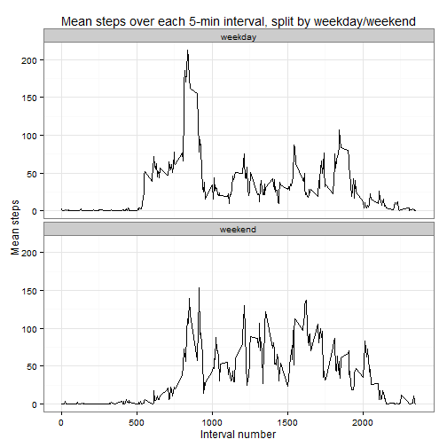

```r
#Header code, setup required libraries
library(ggplot2)
library(plyr)
```

## Loading and preprocessing the data

```r
#unzip file
unzip("./activity.zip", overwrite = FALSE)
```

```
## Warning in unzip("./activity.zip", overwrite = FALSE): not overwriting file
## './activity.csv
```

```r
#read data from file
activity<-read.csv("activity.csv",colClasses=c("integer","Date","integer"))
#question1
stepsperday<-ddply(activity, c("date"),summarise,
                   totalsteps=sum(steps,na.rm=TRUE)
                   )
#question2
stepsper5min<-ddply(activity, c("interval"),summarise,
                    meansteps = mean(steps,na.rm=TRUE)
                    )
```

## What is mean total number of steps taken per day?

The mean total number of steps taken per day is 9354.2295082. 
The median number of steps taken per day is 10395.


```r
histogram<-ggplot(stepsperday,aes(x=totalsteps))+geom_histogram()+
  xlab("Total number of steps")+
  ggtitle("Histogram of total steps in one day")+
  theme_bw()
print(histogram)
```

 

## What is the average daily activity pattern?

```r
lineplot<-ggplot(stepsper5min,aes(x=interval,y=meansteps))+geom_line()+
  ggtitle("Average steps for each 5-min interval")+
  ylab("Mean steps")+
  theme_bw()
print(lineplot)
```

 

The 5-minute interval with the highest average count of steps is interval #835 with a mean of 206.1698113 steps.  

## Imputing missing values

There are 2304 incomplete records, unevenly distributed through the dataset.


```r
hist(which(complete.cases(activity)),
     main="Count of complete cases in chronological order",
     xlab="Observation number",
     ylab="Count of complete cases"
     )
```

 
 
Interpolation is done by using the average of the previous valid observation and the next valid observation, or the average of the 5-minutes interval if there is no valid previous/next observation. 
 

```r
#question3
interpolation <- function(rownumber){
  prevrow=rownumber;
  nextrow=rownumber;
  while(is.na(activity$steps[prevrow])){
    prevrow=prevrow-1
    if(prevrow<1)return(mean(activity[activity$interval==activity$interval[rownumber],"steps"],na.rm=TRUE))
  }
  while(is.na(activity$steps[nextrow])){
    nextrow=nextrow+1
    if(nextrow>nrow(activity))return(mean(activity[activity$interval==activity$interval[rownumber],"steps"],na.rm=TRUE))
  }
  return(
    (activity$steps[prevrow]+activity$steps[nextrow])/2
  )
}

activity_imputedNA <-activity
for(n in 1:nrow(activity)){
  if(is.na(activity$steps[n])){
    activity_imputedNA$steps[n]=interpolation(n);
  }
}
```


```r
stepsperday2<-merge(
  ddply(activity_imputedNA, c("date"),summarise,
        totalsteps2=sum(steps,na.rm=TRUE)
  ),
  stepsperday,
  by="date"
)

histogram2<-ggplot(stepsperday2,aes(x=totalsteps2))+
      xlab("Total number of steps")+geom_histogram()+
  ggtitle("Histogram of total number of steps per day, after missing values imputed")+
    theme_bw()
print(histogram2)
```

 

The mean and median total steps (NA-omitted) are 9354.2295082 and 10395.
The mean and median total steps (NA-imputed) are  9707.219301 and 1.0571 &times; 10<sup>4</sup>. 

## Are there differences in activity patterns between weekdays and weekends?


```r
#question4
workdays= c("Monday","Tuesday","Wednesday","Thursday","Friday")

activity_imputedNA$weekday<-as.factor(ifelse(weekdays(activity_imputedNA$date)%in%workdays,"weekday","weekend"))

stepsperinterval_splitweekends<-ddply(activity_imputedNA, c("interval","weekday"),summarise,
                    meansteps = mean(steps,na.rm=TRUE)
)

lineplot2<-ggplot(stepsperinterval_splitweekends,aes(x=interval,y=meansteps))+
  facet_wrap(~weekday,nrow=2,ncol=1)+
  geom_line()+
  theme_bw()+
  ggtitle("Mean steps over each 5-min interval, split by weekday/weekend")+
  ylab("Mean steps")+
  xlab("Interval number")
print(lineplot2)
```

 

There seems to be higher activity on the weekends, particularly in the middle of the day, although it is lower early in the morning just after waking up.
